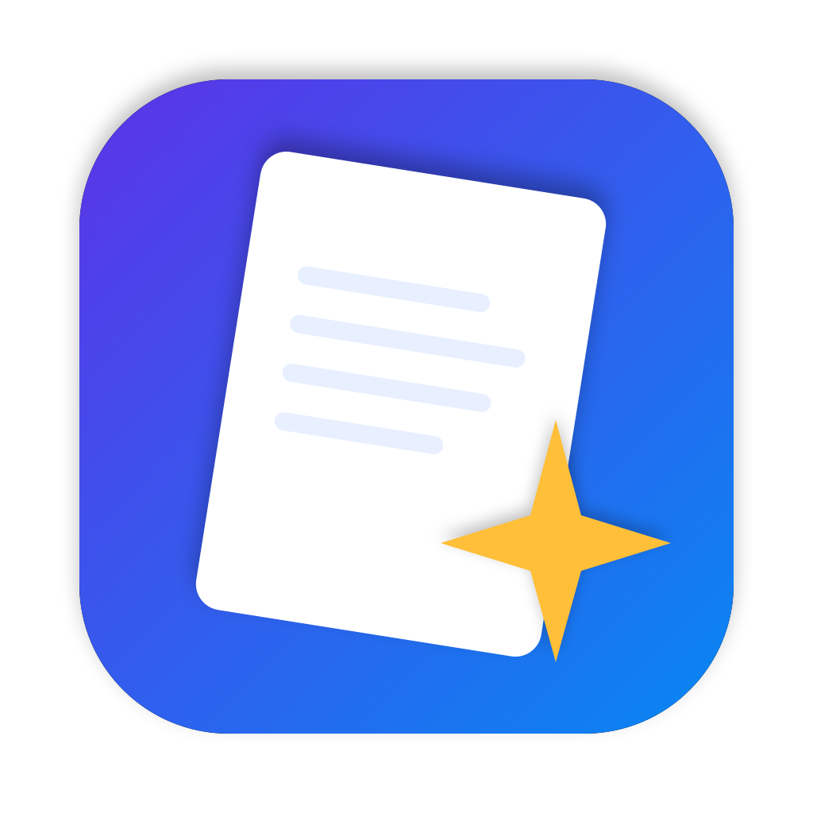

# FolioSpark



**FolioSpark is a vibecoded macOS PDF reader and editor.** It was built with AI-assisted coding and is shared openly so people can use it, inspect it, and improve it. It is an independent project.

**FolioSpark est un lecteur et éditeur PDF macOS vibecodé.** Il a été créé avec l’aide d’une IA pour le code et partagé publiquement afin que chacun puisse l’utiliser, l’examiner et l’améliorer.

## English

Open and read PDFs in tabs; search text; add notes, highlights, underlines, strikeouts, text boxes, and freehand drawings; view comments and bookmarks; reorder, rotate, insert, or delete pages; combine PDFs; compress, password-protect, print, and export to text or PNG images.

Choose **English** or **Français** from the **EN/FR** menu in the top bar or from the **Language / Langue** app menu. Your choice is saved. On first launch, the app follows your system language when it is French, and uses English otherwise.

### Build

Requires macOS 26 or later and Apple Command Line Tools with Swift. From the project folder:

```sh
./build.sh
open build/FolioSpark.app
```

To copy the app to `/Applications`, run `./build.sh --install`. The build script signs the app locally with an ad hoc signature; it is not notarized for distribution. You can also run `swift build -c release` to build only the executable.

### Notes

FolioSpark uses Apple's PDFKit. Some PDF operations depend on what PDFKit supports for a given document. When combining files, locked PDFs are skipped. Keep a copy of important PDFs before editing them.

## Français

Ouvrez des PDF dans des onglets, recherchez du texte, annotez les pages, consultez les commentaires et signets, réorganisez les pages, combinez plusieurs fichiers, compressez ou protégez une copie, imprimez et exportez en texte ou en images PNG.

Choisissez **Français** ou **English** avec le menu **FR/EN** en haut de la fenêtre, ou avec le menu **Langue / Language** de l’app. Le choix est mémorisé. Au premier lancement, la langue suit le système s’il est en français ; sinon l’app démarre en anglais.

### Compiler

Il faut macOS 26 ou plus récent et les outils en ligne de commande Apple avec Swift. Depuis le dossier du projet :

```sh
./build.sh
open build/FolioSpark.app
```

`./build.sh --install` copie l’app dans `/Applications`. L’app compilée reçoit une signature locale ; elle n’est pas notarisée pour une distribution directe.

## License / Licence

MIT — see [LICENSE](LICENSE).
